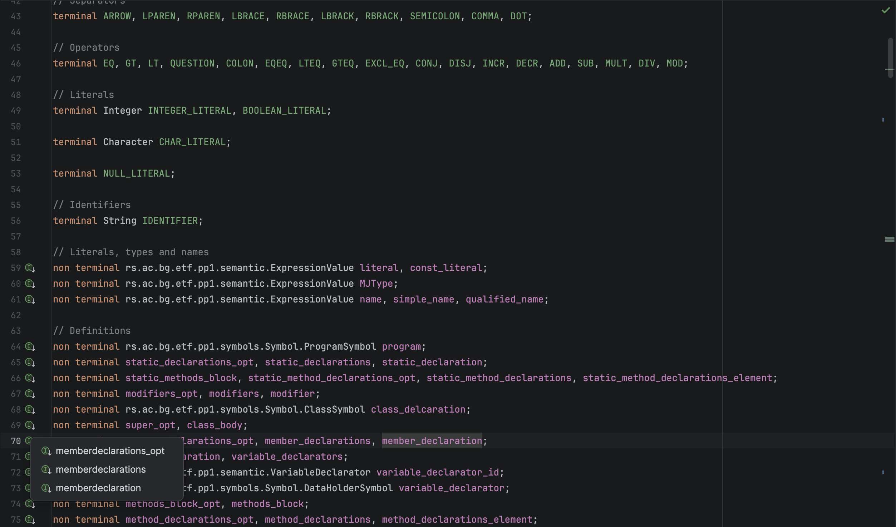
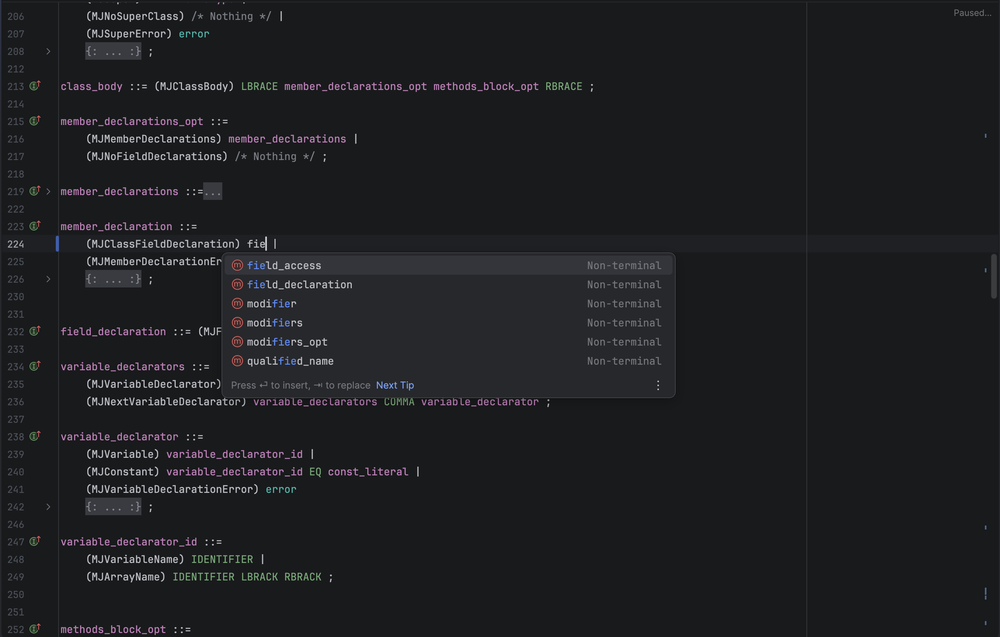

# Java Cupcake

An IntelliJ Platform plugin that adds first-class language support for Java CUP grammar files (`.cup`), making it easier to write and maintain parsers.

Compatible with IntelliJ IDEA (and other IntelliJ-based IDEs) 2024.2 and newer.

## Features

- **Syntax highlighting and inspections** 
- **Context-aware completion** 
- **Quick fixes** 
- **Navigation** 

## Screenshots





## Installation

Java Cupcake is currently published on the **beta** channel of the JetBrains Marketplace, so you need 
to add that channel to your IDE before it will show up in the plugin browser.

1. Open **Settings** (`Ctrl+Alt+S` on Windows/Linux, `⌘,` on macOS) and go to **Plugins**.
2. Click the gear icon at the top of the Plugins page and choose **Manage Plugin Repositories…**.
3. Click **+** and add the following URL:
   ```
   https://plugins.jetbrains.com/plugins/beta/list
   ```
4. Click **OK** to close the dialog.
5. Switch to the **Marketplace** tab, search for **Java Cupcake**, and click **Install**.
6. Restart the IDE when prompted.

Once Java Cupcake leaves beta, you'll be able to install it from the default marketplace without the extra repository step.
